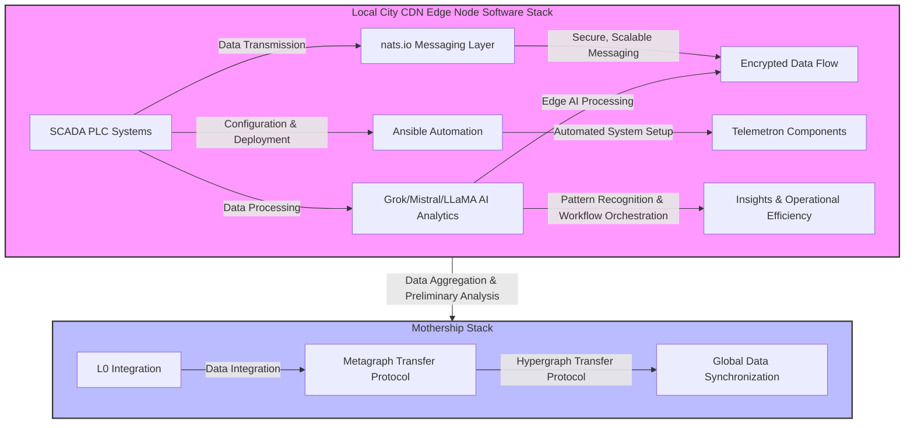

# SBIR 6913G624QSBIR2 Phase 1 Solicitation FW

## Drafted by Eden Advisory and CODE: 6913G624QSBIR2

## Telemetron Situation Appraisal: Phase 1

### Background

Telemetron, a pioneering initiative under the SBIR (Small Business Innovation Research) program, aims to revolutionize the way Small / Mid Market Off Grid Oil pipelines monitor and manage SCADA PLC data streams. The overarching goal is to enhance data security and network efficiency, facilitating a more robust and encrypted data flow within the natural gas sector.

### Challenge

The primary challenges that Telemetron aims to address are:

- **Data Security**: Current SCADA PLC systems are susceptible to cyber threats and unauthorized data access, posing significant risks to operational integrity.
- **Network Efficiency**: The lack of an optimized data network fabric hinders the real-time processing and analysis of critical operational data, affecting decision-making and operational agility.
- **Integration Complexity**: The integration of advanced data analysis and automation tools with existing SCADA PLC systems is complex and often inefficient, leading to potential data silos and integration bottlenecks.

### Proposed Solution

Telemetron proposes a novel technical architecture leveraging `nats.io` for high-performance messaging, `ansible` for automated configuration and deployment, and a combination of `Grok`, `Mistral`, and `LLaMA` for advanced data processing and AI-driven analytics. This architecture is designed to:

- **Secure Data Streams**: Implement state-of-the-art encryption and secure messaging protocols to protect data in transit and at rest.
- **Optimize Network Fabric**: Enhance the data network fabric to support high-volume, real-time data processing and analytics, ensuring operational data is efficiently managed and analyzed.
- **Streamline Integration**: Provide a flexible, scalable architecture that simplifies the integration of SCADA PLC systems with advanced data analytics and automation tools, enabling seamless data flow and interoperability.

### Technical Theoretical Architecture

- **Messaging Layer (`nats.io`)**: Utilize `nats.io` for its lightweight, high-performance messaging system, ensuring secure, scalable, and real-time data transmission across distributed systems.
- **Automation and Configuration (`Ansible`)**: Leverage `Ansible` for its simplicity and agentless architecture to automate the deployment, configuration, and management of Telemetron components, ensuring consistent and repeatable environments.
- **Data Processing and AI Analytics (`Grok`/`Mistral`/`LLaMA`)**: Implement a blend of `Grok` for pattern recognition, `Mistral` for workflow orchestration, and `LLaMA` for advanced machine learning and AI-driven analytics, enhancing the ability to process, analyze, and derive insights from complex operational data.

### Phase 1 Objectives

1. **Infrastructure Assessment**: Evaluate the existing SCADA PLC systems and network infrastructure to identify specific security and efficiency challenges.
2. **Architecture Design**: Develop a detailed technical architecture for Telemetron, incorporating `nats.io`, `ansible`, and `Grok`/`Mistral`/`LLaMA`.
3. **Prototype Development**: Construct a prototype of the Telemetron system to demonstrate feasibility, focusing on secure messaging, system automation, and preliminary data analytics capabilities.
4. **Initial Testing and Validation**: Conduct initial testing to validate the prototype's functionality, security features, and integration capabilities with existing systems.

### Expected Outcomes

The successful initiation and completion of Phase 1 are expected to lay a solid foundation for Telemetron, demonstrating the feasibility and potential impact of the proposed solution on enhancing SCADA PLC data stream management and security for natural gas operators. This phase will culminate in a detailed report outlining the prototype's design, implementation, and initial testing results, setting the stage for further development and commercialization in subsequent phases.

